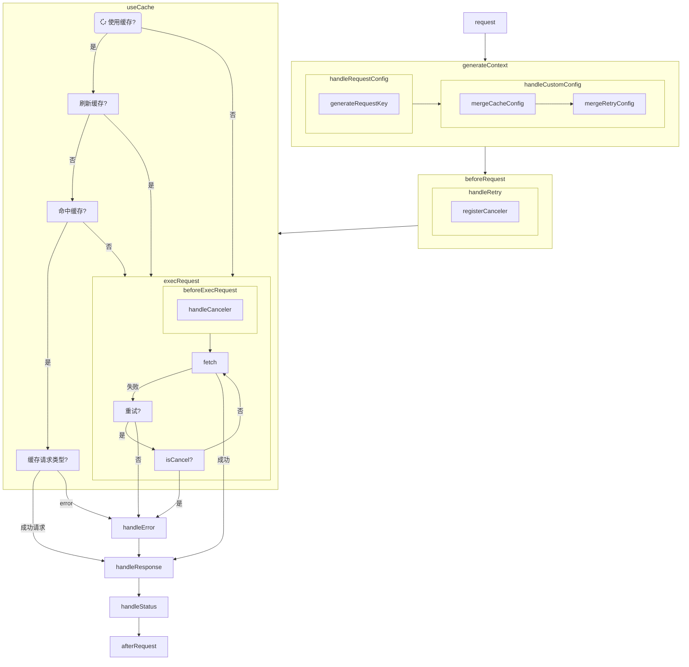
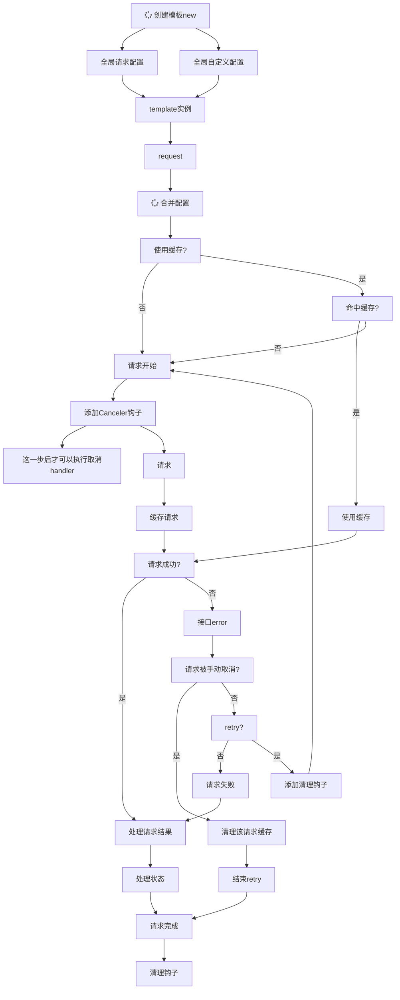

# 方法生命周期

表格内中文为逻辑说明，英文为方法名

```mermaid
flowchart TB

request --> generateContext --> beforeRequest --> useCache


subgraph generateContext
handleRequestConfig --> handleCustomConfig
end

subgraph handleRequestConfig
generateRequestKey
end

subgraph handleCustomConfig
mergeCacheConfig --> mergeRetryConfig
end


subgraph beforeRequest
handleRetry
end


subgraph execRequest
beforeExecRequest --> fetch 
fetch --> |失败| 重试? 
重试? --> |是| isCancel? 
isCancel? --> |否| fetch
end

fetch --> |成功| handleResponse --> handleStatus --> afterRequest
重试? --> |否| handleError
isCancel? --> |是| handleError


subgraph useCache
使用缓存?(fa:fa-spinner 使用缓存?)
使用缓存? --> |是| 刷新缓存? --> |否| 命中缓存? --> |是| 缓存请求类型?

使用缓存? --> |否| execRequest
刷新缓存? --> |是| execRequest
命中缓存? --> |否| execRequest
end

缓存请求类型? --> |成功请求| handleResponse
缓存请求类型? --> |error| handleError

subgraph handleRetry
registerCanceler
end
subgraph beforeExecRequest
handleCanceler
end

handleError --> handleResponse
```

# 生命周期

```mermaid
flowchart
MergeConfig[fa:fa-spinner 合并配置]
CreateTemplate[fa:fa-spinner 创建模板new]
GlobalRequestConfig[全局请求配置]
GlobalCustomConfig[全局自定义配置]


CreateTemplate --> GlobalRequestConfig --> template实例
CreateTemplate --> GlobalCustomConfig --> template实例


template实例 --> request


request --> MergeConfig --> 使用缓存?

添加Canceler钩子 --> 这一步后才可以执行取消handler

使用缓存? --> |否| 请求开始 --> 添加Canceler钩子  --> 请求 -->  缓存请求  --> 请求成功?

使用缓存? --> |是| 命中缓存?

命中缓存?  --> |是| 使用缓存 --> 请求成功?
命中缓存?  --> |否| 请求开始


请求成功? --> |是| 处理请求结果
请求成功? --> |否| 接口error --> 请求被手动取消? --> |是| 清理该请求缓存 --> 结束retry --> 请求完成
请求被手动取消? --> |否| retry?

retry? --> |否| 请求失败 --> 处理请求结果
retry? --> |是| 添加清理钩子 --> 请求开始


处理请求结果 --> 处理状态 --> 请求完成 --> 清理钩子


```
