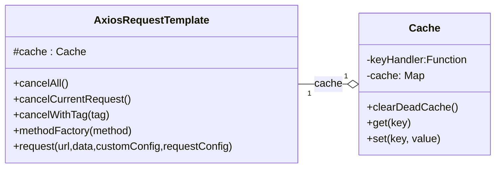
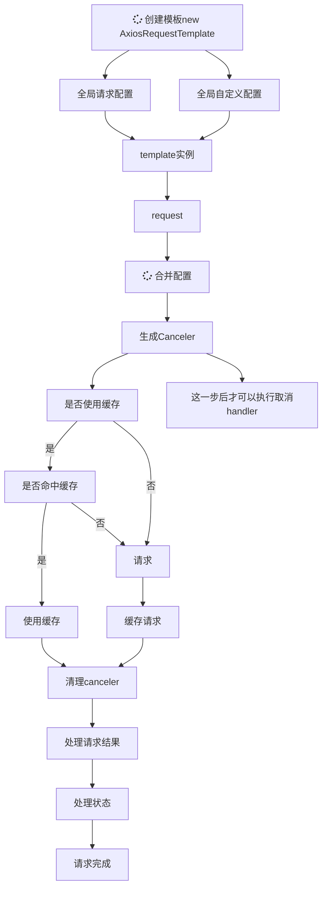

# request-template

基于状态处理实现的 `axios` 请求封装，该库使用模板方法模式实现，每一个步骤都可以被子类覆盖方便扩展

## 流程





## 主要实现

- [X]  非侵入式封装
- [X]  模板方法模式实现
  - [X]  可实现自定义模板，可复用基础模板
- [X]  ts类型提示支持
- [X]  多状态处理
- [X]  接口缓存
  - [X]  自定义缓存命中
- [X]  配置
  - [X]  全局配置(保持统一，复用配置)
  - [X]  局部配置(支持个性{某些不按规范实现的接口})
- [X]  取消请求
  - [X]  取消单个请求
  - [X]  根据 tag 取消请求
  - [X]  取消所有请求

## 安装

```shell
pnpm add request-template
```

## 使用

### 基础用法

#### 使用默认模板

```ts
// new一个实例
const req = new AxiosRequestTemplate();
// request(url: string, data?: {}, customConfig?: DynamicCustomConfig<CC, RC>, requestConfig?: AxiosRequestConfig)
// `request`支持4个参数分别是必填的`url`，和选填的请求数据`data`，自定义设置的`customConfig`,以及`axios`的请求设置`requestConfig`
// `requestConfig`为`axios`原设置，没有任何增删
// `request`默认为`get`请求
req.request('/test', { param1: 1, param2: 2 }).then((res) => {
  console.log(res);
});
// `post`请求，`delete` `patch`也是以此类推
req.request('/test', { param1: 1, param2: 2 }, {}, { method: 'post' }).then((res) => {
  console.log(res);
});
```

这样使用每次都要设置`method`有些麻烦了，可以用`methodFactory`函数生成一个`method`函数简化一下

```ts
// 'post','get','patch'...
const post = req.methodFactory('post');
post('/test', { param1: 1, param2: 2 }).then((res) => {
  console.log(res);
});
post('/test', { param1: 1, param2: 2 }).then((res) => {
  console.log(res);
});
```

`methodFactory`生成的`method`函数与`request`参数返回值一致，且`requestConfig`里的`method`属性不再起作用

### 进阶用法

#### 创建自定义模板

该库使用模板方法模式实现，所以每个处理模块都可以用子类实现

以下是可以继承重写的一些数据处理函数

```ts
// 缓存命中规则处理
protected transformCacheKey(requestConfig: AxiosRequestConfig): string;
// 请求结果数据结构转换
protected transformRes<T>(requestConfig: AxiosRequestConfig, customConfig: CC, response: AxiosResponse): ResType<T>;
// 设置拦截器
protected setInterceptors(): void;
// 处理取消函数
protected handleCanceler(requestConfig: AxiosRequestConfig, customConfig: CustomConfig): void;
// 处理请求配置
protected handleRequestConfig(url: string, requestConfig: AxiosRequestConfig): AxiosRequestConfig;
// 处理自定义配置
protected handleCustomConfig(customConfig: CC): CC;
// 处理请求用的数据
protected handleRequestData(data: {}, requestConfig: AxiosRequestConfig): void;
// 处理响应结果
protected handleResponse<T>(response: AxiosResponse<ResType<any>>, data: ResType<any>, customConfig: CC): Promise<ResType<T>>;
// 请求
protected doRequest(requestConfig: AxiosRequestConfig, customConfig: CC): Promise<AxiosResponse<any, any>>;

```

首先定义一个封装模板

```ts
import { StatusHandlers, CustomConfig, HttpStatus, AxiosRequestTemplate } from 'request-template';

// 通用错误Handler
const errorHandler: StatusHandler<CustomConfig> = (res, data, customConfig) => {
  if (!customConfig.silent) {
    // ElMessage({ type: 'error', message: data.msg })
    console.log('非静音模式，显示错误信息');
  }
  // throw data.data || new Error( `data: ${JSON.stringify(data)}`);
  return Promise.reject(customConfig.returnRes ? res : data);
};

const statusHandlers: StatusHandlers = {
  // 登录过期
  [HttpStatus.UNAUTHORIZED]: (res, data, customConfig) => {
    if (res.status === HttpStatus.UNAUTHORIZED) {
      // Store.clearUser();
      console.log('清理掉保存的用户信息');
      Token.clear();
    }
    return errorHandler(res, data, customConfig);
  },
  // token更新了
  207: (res, data, customConfig) => {
    data.data.token && Token.set(data.data.token);
    return customConfig.returnRes ? res : data;
  },
  // 成功
  [HttpStatus.OK]: (res, data, customConfig) => {
    return customConfig.returnRes ? res : data;
  },
  // 其余所有都提示失败
  default: errorHandler,
};
```

直接使用 AxiosRequestTemplate

```ts
const req = new AxiosRequestTemplate<CustomConfig>({ baseURL: '/' }, { statusHandlers });
// 使用methodFactory生成请求方法
const get = req.methodFactory('get');
const post = req.methodFactory('post');
```

或者继承 AxiosRequestTemplate 作为一个固定模板(推荐)

```ts
/**
 * 主域名请求类
 * 单例模式
 */
export default class PrimaryRequest extends AxiosRequestTemplate {
  static readonly ins = new PrimaryRequest();
  // 把get，post挂到static上
  static readonly get = PrimaryRequest.ins.methodFactory('get');
  static readonly post = PrimaryRequest.ins.methodFactory('post');

  private constructor() {
    super({ baseURL: import.meta.env.VITE_BASE_URL }, { statusHandlers });
  }

  protected setInterceptors() {
    this.interceptors.request.use((config) => {
      if (!config.headers) config.headers = {};
      const headers = config.headers as AxiosRequestHeaders;
      Token.exists() && (headers.authorization = `Bearer ${Token.get()}`);
      // headers.uuid = getUUID();
      return config;
    });
  }
}
```

最好再封装成 API

```ts
const { post, get } = PrimaryRequest;
export class User {
  username!: string;
  id!: number;
  static login(data: { username: string; password: string }) {
    return post<{ token: string }>('/user/login', data);
  }
  static getSelf() {
    const req = get<{ user: User }>('/user/self', {}, { silent: true });
    const cancel = PrimaryRequest.ins.cancelCurrentRequest;
    setTimeout(() => cancel('cancel test'));
    return req;
  }
}
```

### 使用缓存

命中缓存时，该次请求结果会直接从缓存中拿，不会发起新的请求

#### 默认 5 秒内使用缓存

```ts
const { post } = PrimaryRequest;
export function login(data: { username: string; password: string }) {
  // 5秒内都会是同样的数据
  return post<{ token: string }>('/user/login', data, { useCache: true });
}
```

#### 自定义过期时间

```ts
const { post } = PrimaryRequest;
export function login(data: { username: string; password: string }) {
  // timeout单位为毫秒
  return post<{ token: string }>('/user/login', data, { useCache: { timeout: 30 * 60 * 1000 } });
}
```

#### 自定义缓存命中策略

默认缓存命中策略为`{url,headers,data}`三个合成的对象转为的字符串是一样的则会命中缓存

现在在原有基础上添加一条：只要是`login`接口就命中缓存

```ts
export default class MyTemplate extends AxiosRequestTemplate {
  private constructor() {
    super({ baseURL: 'http://test.test' });
  }

  // 转换缓存所用的key
  protected transformCacheKey(requestConfig: AxiosRequestConfig): string {
    // 只要是登录接口就命中缓存
    if (requestConfig.url.includes('login')) {
      return 'login';
    }
    // 复用之前的逻辑
    return super.transformCacheKey(requestConfig, AxiosRequestConfig);
  }
}
```

### 取消请求

#### 取消当前请求

获取取消函数的时机很重要，必须在 request、get、post 等请求方法执行后获取的取消函数才是有效的，而且必须使用对应的实例来取消请求

```ts
const req = login({ username: 'test', password: 'test' });
// 必须使用对应的实例来取消请求
PrimaryRequest.ins.cancelCurrentRequest('test');
try {
  await req;
} catch (e: { message: string }) {
  // 会捕获该报错
  // message: "test"
}
```

#### 取消所有请求

```ts
const req = login({ username: 'test', password: 'test' });
// 或者
PrimaryRequest.ins.cancelAll('test');
try {
  await req;
} catch (e: { message: string }) {
  // 会捕获该报错
  // message: "test"
}
```

#### 根据`tag`取消请求

```ts
const { post } = PrimaryRequest;
export function login(data: { username: string; password: string }) {
  // timeout单位为毫秒
  return post<{ token: string }>('/user/login', data, { tag: 'cancelable' });
}
```

```ts
const req = login({ username: 'test', password: 'test' });
// 或者
PrimaryRequest.ins.cancelWithTag('cancelable', 'test');
try {
  await req;
} catch (e: { message: string }) {
  // 会捕获该报错
  // message: "test"
}
```

### 全局配置与局部配置

new 一个模板时构造器接收的配置的为全局配置，get、post 时传过去的为局部配置，请求时局部配置优先于全局配置，且不会污染全局配置

### 转换响应数据结构

如果你接口返回的数据结构不是`{code:number;msg:string;data:any}`这种格式的话就需要继承基础模板然后重写`transformRes`方法
