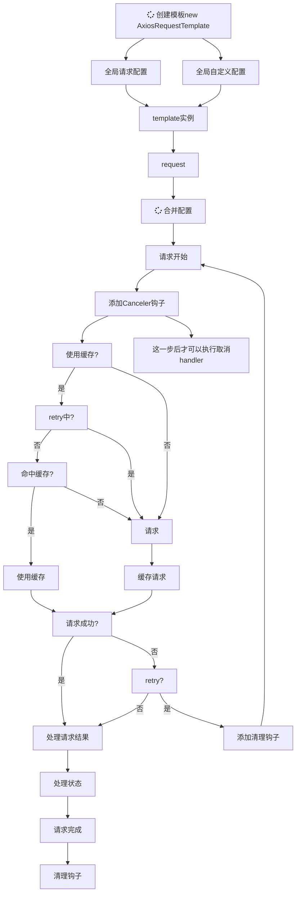

# request-template

## 前言

关于 axios 的封装不胜枚举。

但看上去大部分都是单独的函数：如单独的取消请求，缓存，自动带上 token 等等。

结构过于松散，不够封装，需要用户手动复制过来，过于麻烦，且一旦业务改了又得重写一堆；又或封装了但扩展性太低，无法根据业务调整而调整。

缺乏关于一整套完整的方案。

针对以上问题，我实现了该库[`request-template`](https://github.com/mengxinssfd/request-template)。

基于 `axios` 的请求封装，该库使用模板方法模式实现，每一个步骤都可以被子类覆盖方便扩展。

你也可以使用`fetch`来请求，只需要重写使用到`axios`的关键步骤。

这不是一个最终方案，不是说用了这个库就能什么都不用写了，但它能极大减少你的代码复杂度，提高代码的复用性，为你的最终方案提供支持。

面向继承开放，面向使用关闭。

封装但不封闭

## 生命周期



## 主要实现

- [X]  非侵入开放式封装
  - [X]  对于继承扩展开放
  - [X]  对于使用时修改关闭
- [X]  模板方法模式实现
  - [X]  可实现自定义模板
  - [X]  可继承复用基础模板
  - [X]  可复用 api 级配置
- [X]  多实例
- [X]  ts 类型支持
  - [X]  范型支持
  - [X]  原 axios 类型支持
- [X]  多状态处理
- [X]  接口缓存
  - [X]  自定义缓存命中规则
- [X]  配置
  - [X]  全局配置(保持统一，复用配置)
  - [X]  局部配置(支持个性化配置{某些不按规范实现的接口})
- [X]  取消请求
  - [X]  取消单个请求
  - [X]  根据 tag 取消请求
  - [X]  取消所有请求
- [X]  请求失败重试
  - [X]  重试次数
  - [X]  延时重试
  - [X]  第一次重试立即启动（可选）
  - [X]  中断重试

## 安装

可以使用`npm` `cnpm` `yarn` `pnpm`等方式安装，推荐使用`pnpm`安装减少`node_module`体积

```shell
pnpm add request-template
```

## 基础用法（使用默认模板）

### 零配置直接使用

这时约等于`axios({url})`

```ts
// new一个实例
const template = new AxiosRequestTemplate();

// request<T = never, RC extends boolean = false>(requestConfig: Omit<AxiosRequestConfig, 'cancelToken' | 'url'> & {
//        url: string;
//    }, customConfig?: DynamicCustomConfig<CC, RC>): Promise<RC extends true ? AxiosResponse<ResType<T>> : ResType<T>>;

// `request`支持2个参数分别是`axios`的请求设置`requestConfig`以及，自定义设置的`customConfig`
// `requestConfig`为`axios`原设置
// `request`默认为`get`请求
template.request({ url: '/test', params: { param1: 1, param2: 2 } }).then((res) => {
  console.log(res);
});
// `post`请求，`delete` `patch`也是以此类推
template.request({ url: '/test', data: { param1: 1, param2: 2 }, method: 'post' }).then((res) => {
  console.log(res);
});
```

### 使用`methodFactory`方法生成一个`method`函数

上面使用每次都要设置`method`有些麻烦了，可以用`methodFactory`函数生成一个`method`函数简化一下

```ts
// 'post','get','patch'...
const post = template.methodFactory('post');
post({ url: '/test', data: { param1: 1, param2: 2 } }).then((res) => {
  console.log(res);
});
post({ url: '/test', data: { param1: 1, param2: 2 } }).then((res) => {
  console.log(res);
});
```

注意：`methodFactory`生成的 `method`函数与 `request`参数返回值一致，且 `requestConfig`里的 `method`属性不再起作用

该方法第二个参数接收一个`handler`可以对配置进行一些处理，如设置一些公共 url 前缀等。

### 使用缓存

命中缓存时，该次请求结果会直接从缓存中拿，不会发起新的请求

#### 默认 5 秒内使用缓存

```ts
export function login(data: { username: string; password: string }) {
  // 5秒内都会是同样的数据
  return post<{ token: string }>({ url: '/user/login', data }, { cache: true });
}
```

注意：因避免使用过长的缓存时间，否则有内存溢出的风险。

#### 自定义过期时间

```ts
export function login(data: { username: string; password: string }) {
  // timeout单位为毫秒
  return post<{ token: string }>(
    { url: '/user/login', data },
    { cache: { timeout: 30 * 60 * 1000 } },
  );
}
```

### 取消请求

很多人不知道取消请求的作用，说什么后端还是会收到请求，请求还是发出去了什么的。

其实那些我们完全不需要关心，

我们只需要关心：不要再处理接口后续，也就是说那些接口不管成不成功那些结果我都不要了，这就是取消请求的意义

#### 取消当前请求

取消函数的时机很重要，必须在 request、get、post 等请求方法执行后获取的取消函数才是有效的，而且必须使用对应的实例来取消请求

```ts
const req = login({ username: 'test', password: 'test' });
// 必须使用对应的实例来取消请求
template.cancelCurrentRequest('cancel message');
try {
  await req;
} catch (e: { message: string }) {
  // 会捕获该报错
  // message: "cancel message"
}
```

使用该方法可以取消失败重试，但由于时机难以确定，当前请求可能其他请求，所以不推荐使用它取消重试

#### 取消所有请求

```ts
const req = login({ username: 'test', password: 'test' });
// 或者
template.cancelAll('cancel message');
try {
  await req;
} catch (e: { message: string }) {
  // 会捕获该报错
  // message: "cancel message"
}
```

可以取消重试，但范围太大，可能会误伤其他请求

#### 根据`tag`取消请求

```ts
export function login(data: { username: string; password: string }) {
  // timeout单位为毫秒
  return post<{ token: string }>('/user/login', data, { tag: 'cancelable' });
}
```

```ts
const req = login({ username: 'test', password: 'test' });
template.cancelWithTag('cancelable', 'cancel message');
try {
  await req;
} catch (e: { message: string }) {
  // 会捕获该报错
  // message: "test"
}
```

使用`tag`方式取消很方便灵活且实用，我们可以在请求前取消相同`tag`的请求；

或者复用模板时所有请求设置一个默认`tag`，然后某一个请求设置为不一样的`tag`，从而实现反向`tag`取消的功能

还能取消正在执行中的失败重试

### 失败重试

#### 重试

重试 3 次，`http`状态码非`200`时会重试 3 次

```ts
try {
  await post({ url: '/retry' }, { retry: 3 });
} catch (e: any) {
  // 会捕获最后一次请求的错误
}
```

#### 重试间隔

每次重试间隔 3 秒, `interval`缺省时为 0 秒，也就是说每次都是`setTimeout(request, undefined))`请求

```ts
try {
  await post({ url: '/retry' }, { retry: { times: 3, interval: 3000 } });
} catch (e: any) {
  // 会捕获最后一次请求的错误
}
```

#### 第一次重试零间隔

每次重试间隔 3 秒, 第一次重试零间隔，也就是说第一次重试是`setTimeout(request, undefined))`请求

```ts
try {
  await post({ url: '/retry' }, { retry: { times: 3, interval: 3000, immediate: true } });
} catch (e: any) {
  // 会捕获最后一次请求的错误
}
```

#### 取消重试

错误的方式

```ts
const req = post({ url: '/retry' }, { retry: 3 });
const cancel = template.cancelCurrentRequest;
cancel(); // 错误，由于`cancelCurrentRequest`会记住当前请求，此时无法确定当前是哪个请求
try {
  await req;
  // do something
} catch (e) {
  // do something
}
```

由于`cancelCurrentRequest`会记住此时无法确定当前是哪个请求，虽然可以直接调用`template.cancelCurrentRequest()`，但是如果请求多的话，可能会误伤其他请求。

所以最好的办法是使用`tag`方式取消请求：

正确的方式

```ts
const symbol = Symbol('cancel'); // 可以使用字符串，但是用Symbol可以让tag不会与任何tag重复
const req = post({ url: '/retry' }, { retry: 3, tag: symbol });
template.cancelWithTag(symbol, 'msg');
try {
  await req;
  // do something
} catch (e) {
  // do something
}
```

### 多状态处理

使用默认模板时需要后台数据结构为`{data:any; code: number; msg: string;}`

请求级状态处理更多时候是作为一种补充，常用状态处理推荐写到`自定义模板`+`全局配置`上

```ts
post(
  '/login',
  {},
  {
    statusHandlers: {
      // code为200时调用
      200(_, res, data) {
        // do something
      },
      // code为20时调用
      20(_, res, data) {
        // do something
      },
    },
  },
);
```

### 全局配置

```ts
import { AxiosRequestTemplate } from './AxiosRequestTemplate';

const template = new AxiosRequestTemplate({
  // AxiosRequestConfig axios配置
  requestConfig: { data: { a: 1 }, params: { a: 1 } },
  // 自定义配置
  customConfig: {
    tag: 'cancelable',
    retry: { times: 3, interval: 3000, immediate: true },
    statusHandlers: {
      // code为200时调用
      200(_, res, data) {
        // do something
      },
      // code为20时调用
      20(_, res, data) {
        // do something
      },
    },
    cache: { timeout: 30 * 60 * 1000, enable: true },
  },
});
```

```ts
const post = template.methodFactory('post');
post('/test').then((res) => {
  // do something
});
```

此时的每次请求都会使用缓存，带上`tag`，使用状态处理，失败重试， `data`或`params`会带上`{a:1}`，

`cache`有一个小技巧，可以先设置`{ timeout: 30 * 60 * 1000, enable: false }`，把`enable`设置为`false`，只设置`timeout`

然后请求时，把`cache`设置为`true`，那么就可以全局不使用缓存，只使用缓存时间，请求时再开启请求缓存功能

```ts
post({ url: '/test' }, { cache: true }).then((res) => {
  // do something
});
```

## 场景

### 全局请求`loading`

以`elementPlus`为例，具体可以使用自己喜欢的 ui 库实现

```ts
import { ElLoading, ILoadingInstance } from 'element-plus';
import { AxiosRequestTemplate, Context, CustomConfig } from 'request-template';

interface MyConfig extends CustomConfig {
  loading?: boolean;
}

class RequestWithLoading<CC extends MyConfig = MyConfig> extends AxiosRequestTemplate<CC> {
  private loading?: ILoadingInstance;

  protected beforeRequest(ctx: Context<CC>) {
    super.beforeRequest(ctx); // 复用基础模板逻辑
    if (ctx.customConfig.loading) {
      this.loading = ElLoading.service({ fullscreen: true });
    }
  }

  protected afterRequest(ctx) {
    super.afterRequest(ctx); // 复用基础模板逻辑
    // 加个定时器避免请求太快，loading一闪而过
    setTimeout(() => {
      this.loading?.close();
    }, 200);
  }
}
```

```ts
// 可以配置默认是开启还是关闭，此例子默认所有的都开启
const req = new RequestWithLoading({}, { loading: true });

const get = req.simplifyMethodFactory('get');

// 此时所有的请求都可以带上loading
get('/test');
get('/test');

// 单独某个请求不使用`loading`
get('/test', {}, { loading: false });
```

注意：`elementPlus`例子多次调用`loading`并不会打开多个`loading`

> 需要注意的是，以服务的方式调用的全屏 Loading 是单例的。 若在前一个全屏 Loading 关闭前再次调用全屏 Loading，并不会创建一个新的 Loading 实例，而是返回现有全屏 Loading 的实例

如果你的`loading`不是单例的，那么你需要自己处理一下多个`loading`存在可能导致的问题

### 全局请求带上`token`

`token`操作封装，默认保存到`localStorage`,可以按照自己喜欢保存到`sectionStorage`或`cookie`上

```ts
export class Token {
  private static KEY = 'token';

  static set key(key: string) {
    Token.KEY = key;
  }
  static get key(): string {
    return Token.KEY;
  }

  static get(): string {
    return localStorage.getItem(Token.KEY) || '';
  }
  static set(token: string) {
    localStorage.setItem(Token.KEY, token);
  }

  static clear() {
    localStorage.removeItem(Token.KEY);
  }
  static exists(): boolean {
    return !!Token.get();
  }
}
```

状态码为`401`时清除`token`, 状态码为`207`时保存`token`,

```ts
import { StatusHandlers } from 'request-template';
export const statusHandlers: StatusHandlers = {
  401: (ctx, res, data) => {
    Token.clear();
    return Promise.reject(data);
  },
  207: ({ customConfig }, res, data) => {
    data.data.token && Token.set(data.data.token);
    return customConfig.returnRes ? res : data;
  },
};
```

如果`token`是放置在`headers`，那么在设置`axios`配置时顺带配置好`headers`

```ts
export class PrimaryRequest extends AxiosRequestTemplate {
  protected handleRequestConfig(url, requestConfig) {
    if (!requestConfig.headers) requestConfig.headers = {};
    Token.exists() && (requestConfig.headers.authorization = `Bearer ${Token.get()}`);
    return super.handleRequestConfig(url, requestConfig);
  }
}
```

如果`token`是放置在`data`，那么在设置`axios`配置时顺带配置好`data`

```ts
export class PrimaryRequest extends AxiosRequestTemplate {
  protected handleRequestData(ctx, data) {
    if (Token.exists()) {
      data.token = Token.get();
    }
    super.handleRequestData(ctx, data);
  }
}
```

也可以想很多人那样设置在拦截器上，不过个人不是很推荐，这样有点不太好理解

```ts
export class PrimaryRequest extends AxiosRequestTemplate {
  protected setInterceptors() {
    this.interceptors.request.use((requestConfig) => {
      if (!requestConfig.headers) requestConfig.headers = {};
      Token.exists() && (requestConfig.headers.authorization = `Bearer ${Token.get()}`);
    });
  }
}
```

### 自定义缓存命中策略

默认缓存命中策略为 `{url,headers,data,method}`4 个合成的对象转为的字符串是一样的则会命中缓存

现在在原有基础上添加一条：根据`tag`命中缓存

```ts
export default class MyTemplate extends AxiosRequestTemplate {
  private readonly cacheKeys = ['cache', 'login'];
  private constructor() {
    super({ baseURL: 'http://test.test' });
  }

  // 转换缓存所用的key，默认根据配置生成key
  protected generateRequestKey(ctx): string {
    // 只要是tag在cacheKeys中就命中缓存
    const tag = ctx.customConfig.tag;
    if (cacheKeys.includes(tag)) {
      return tag;
    }
    // 复用之前的逻辑
    return super.generateRequestKey(ctx);
  }
}
```

### post 请求参数序列化

有时候后端要求`Content-Type`必须以`application/x-www-form-urlencoded`形式，这时候我们需要处理一下`headers`和`data`,

```ts
import Qs from 'qs';
export default class MyTemplate extends AxiosRequestTemplate {
  protected handleRequestConfig(requestConfig) {
    requestConfig = super.handleRequestConfig(requestConfig);
    //  设置headers
    if (!requestConfig.headers) requestConfig.headers = {};
    requestConfig.headers['Content-Type'] = 'application/x-www-form-urlencoded';

    // qs序列化
    if (
      String(requestConfig.method).toLowerCase() === 'post' &&
      !(requestConfig.data instanceof FormData)
    ) {
      requestConfig.data = Qs.stringify(requestConfig.data);
    }

    return requestConfig;
  }
}
```

或者使用`axios`全局配置

```ts
import Qs from 'qs';
export default class MyTemplate extends AxiosRequestTemplate {
  constructor() {
    //  设置headers
    super({ headers: { 'Content-Type': 'application/x-www-form-urlencoded' } });
  }

  protected handleRequestConfig(requestConfig) {
    requestConfig = super.handleRequestConfig(requestConfig);
    // qs序列化
    if (
      String(requestConfig.method).toLowerCase() === 'post' &&
      !(requestConfig.data instanceof FormData)
    ) {
      requestConfig.data = Qs.stringify(requestConfig.data);
    }
    return requestConfig;
  }
}
```

## 完整 demo

这是我博客前台的`api`使用封装

环境：vue3、vite、ts、elementplus

目录结构

```text
src
├── api
|  ├── user.ts // 具体的api
|  ├── tag.ts // 具体的api
|  └── ....
├── http
|  ├─── primary // 主模板
|  |   ├── index.ts // 请求模板
|  |   ├── token.ts // token操作工具类
|  |   └── statusHandlers.ts // 状态处理
|  └─── other  // 其他规则模板
|      ├── index.ts // 请求模板
|      └── statusHandlers.ts // 状态处理
```

### 主模板封装

#### src/primary/token.ts

`token`封装类

```ts
export class Token {
  private static KEY = 'token';

  static set key(key: string) {
    Token.KEY = key;
  }
  static get key(): string {
    return Token.KEY;
  }

  static get(): string {
    return localStorage.getItem(Token.KEY) || '';
  }
  static set(token: string) {
    localStorage.setItem(Token.KEY, token);
  }

  static clear() {
    localStorage.removeItem(Token.KEY);
  }
  static exists(): boolean {
    return !!Token.get();
  }
}
```

#### src/primary/statusHandlers.ts

给用户提示错误信息，`token`的保存、清理、刷新等操作的通用处理

```ts
import { HttpStatus, StatusHandler, StatusHandlers, CustomConfig } from 'request-template';
import { ElMessage } from 'element-plus';
import { Token } from './token';
import Store from '@/store/index';

// 通用错误Handler
const commonErrorHandler: StatusHandler<CustomConfig> = ({ customConfig }, res, data) => {
  // 非静音模式下，有错误直接显示错误信息
  !customConfig.silent && ElMessage({ type: 'error', message: data.msg });
  return Promise.reject(customConfig.returnRes ? res : data);
};

export const statusHandlers: StatusHandlers = {
  //  401 token失效或者未登录
  [HttpStatus.UNAUTHORIZED]: (ctx, res, data) => {
    // 从vuex或pinia中删除用户信息
    // Store.commit('clearUser');
    Token.clear();
    return commonErrorHandler(ctx, res, data);
  },
  // token刷新时
  207: ({ customConfig }, res, data) => {
    data.data.token && Token.set(data.data.token);
    return customConfig.returnRes ? res : data;
  },
  // 200 普通成功请求
  [HttpStatus.OK]: ({ customConfig }, res, data) => {
    return customConfig.returnRes ? res : data;
  },
  // ...
  // 其余状态全部走错误处理
  default: commonErrorHandler,
};
```

#### src/primary/index.ts

实现自定义请求模板

```ts
import { Token } from './token';
import { statusHandlers } from './statusHandlers';
import { AxiosRequestTemplate, Context, CustomConfig } from 'request-template';
import { ElLoading, ILoadingInstance } from 'element-plus';
import { Method } from 'axios';

let uuid = localStorage.getItem('uuid');

interface LoadingCustomConfig extends CustomConfig {
  loading?: boolean;
}

export class PrimaryRequest<
  CC extends LoadingCustomConfig = LoadingCustomConfig,
> extends AxiosRequestTemplate<CC> {
  // 单例模式
  static readonly ins = new PrimaryRequest();
  
  private loading?: ILoadingInstance;

  private constructor() {
    super(
      //  baseUrl，axios配置，每个请求都会拼接上baseUrl作为前缀，跟process.env.BASE_URL类似
      { baseURL: import.meta.env.VITE_BASE_URL },
      // 缓存设置60秒
      { statusHandlers, cache: { enable: false, timeout: 60 * 1000 }, loading: false } as CC,
    );
  }

  // 请求前开启loading
  protected beforeRequest(ctx: Context<CC>) {
    super.beforeRequest(ctx); // 复用基础模板逻辑
    if (ctx.customConfig.loading) {
      this.loading = ElLoading.service({ fullscreen: true });
    }
  }

  // 请求后关闭loading
  protected afterRequest(ctx) {
    super.afterRequest(ctx); // 复用基础模板逻辑
    // 加个定时器避免请求太快，loading一闪而过
    setTimeout(() => {
      this.loading?.close();
    }, 200);
  }

  // 生成uuid
  private static getUUID() {
    if (uuid) {
      return uuid;
    }
    uuid = Math.floor(Math.random() * 0xffffffffff).toString(16);
    localStorage.setItem('uuid', uuid);
    return uuid;
  }

  // 处理config，添加uuid和token到headers
  protected handleRequestConfig(requestConfig) {
    if (!requestConfig.headers) requestConfig.headers = {};
    Token.exists() && (requestConfig.headers.authorization = `Bearer ${Token.get()}`);
    requestConfig.headers.uuid = PrimaryRequest.getUUID();
    return super.handleRequestConfig(requestConfig);
  }

  // 通过数组生成method
  methodsWithUrl(methods: Method[], urlPrefix: string) {
    return methods.map((method) => this.simplifyMethodFactory(method, urlPrefix));
  }
}

// 导出公共的method
export const [Get, Post, Patch, Delete] = PrimaryRequest.ins.methodsWithUrl(
  ['get', 'post', 'patch', 'delete'],
  '',
);
```

#### src/api/user.ts

user模块

```ts
import { PrimaryRequest } from '@/http/primary';

// 复用url前缀
const urlPrefix = '/api/user';
const [Get, Post, Patch, Delete] = PrimaryRequest.ins.methodsWithUrl(
  ['get', 'post', 'patch', 'delete'],
  urlPrefix,
);

export interface User {
  id: number;
  nickname: string;
  avatar: string;
  username: string;
  loginAt: string;
  createAt: string;
  muted: boolean;
  deletedAt: string;
}
export function getSelf() {
  return Get<{ user: User }>('/self', {}, { silent: true });
}
export function deleteUser(id: string | number) {
  return Delete('/' + id);
}
export function restoreUser(id: string | number) {
  return Patch('/restore/' + id);
}
export function getUserAll() {
  return Get<{ list: User[]; count: number }>(urlPrefix, {});
}
export function getUserById(id: number | string) {
  return Get<User>('/' + id);
}
export function login(data: {}) {
  return Post<{ token: string }>('/login', data);
}
export function register(data: {}) {
  return Post('/register', data);
}
export function updateUserInfo(userId: number | string, data: {}) {
  return Patch('/' + userId, data);
}
export function updatePassword(userId: number | string, data: {}) {
  return Patch('/password/' + userId, data);
}
export function muteUser(userId: number | string) {
  return Patch('/mute/' + userId);
}
export function cancelMuteUser(userId: number | string) {
  return Patch('/cancel-mute/' + userId);
}
```

#### src/api/tag.ts

tag模块

```ts
import { Get, Post } from '@/http/primary';

const url = '/api/tag';

export interface Tag {
  createAt: string;
  description: string;
  id: number | string;
  name: string;
}

export function createTag(data: {}) {
  return Post(url, data);
}

export function getTags() {
  return Get<Tag[]>(url);
}
```
